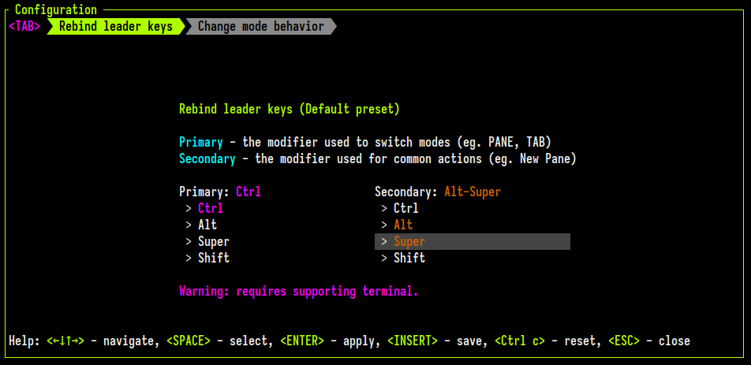

# Changing Modifiers
Zellij uses two different modifiers to distinguish between two main sets of actions.

##### The Primary Modifier (default: `Ctrl`)
This modifier is used to access the different modes (eg. `Pane` and `Tab`). Its exact usage depends on one's [preset](./keybinding-presets).

##### The Secondary Modifier (default: `Alt`)
This modifier is used for common shortcuts (eg. `Alt n` to open a new pane or `Alt f` to toggle floating panes).

## Rebinding Modifiers

Other than [manually configuring](./keybindings.md) keybindings, modifiers can be changed without overriding the current configuration through the `Configuration` screen, accessible with:

* `Ctrl o` + `c` in the default preset
* `Ctrl g` + `o` + `c` in the `Unlock-First` preset

For the `Unlock-First` preset, one can change the `Unlock Toggle` entirely.

## A note about multiple modifiers
While it's certainly possible to change these modifiers to `Ctrl Alt`, `Super` or even `Ctrl Shift Alt` - these all require the usage of a terminal emulator which itself supports multiple modifiers. Examples include: `Alacritty`, `WezTerm` and `foot`.
