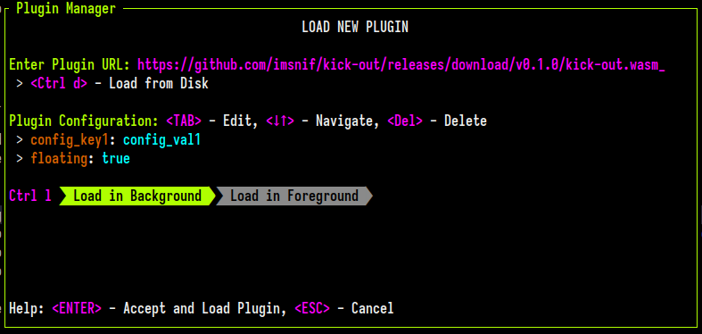

# Loading Plugins
Plugins can either be loaded through a [Layout](./creating-a-layout.md#plugin), through the [command line](./zellij-plugin.md), or from a [keybinding](keybindings-possible-actions.md#launchorfocusplugin).

## On startup
Plugins can also be loaded on startup through the `load_plugins` [configuration block](./configuration.md). Eg.

```
load_plugins {
    https://example.com/my-plugin.wasm
    file:/path/to/my/plugin.kdl
    my-plugin-alias
}
```
These plugins will be loaded in the background on session startup, only appearing once to request permissions from the user if they need any.

## Through the built-in `plugin-manager`
Plugins can also be loaded (in the background or foreground) through the plugin manager. This built-in plugin, accessible by default with `Ctrl o` + `p`, allows both loading plugins and monitoring existing plugins:




## Plugin URL schema
Plugins are referred to by URLs. Currently there are four supported schemas:
1. The file schema: `file:/absolute/path/to/my/plugin.wasm` - for reading plugins from the local HD
2. The built-in `zellij:` schema (eg. `zellij:tab-bar`) for loading built-in zellij plugins.
3. Urls (`http(s)://path/to/my/plugin.wasm`)
4. Bare aliases (`filepicker`), see [Plugin Aliases](./plugin-aliases.md)
